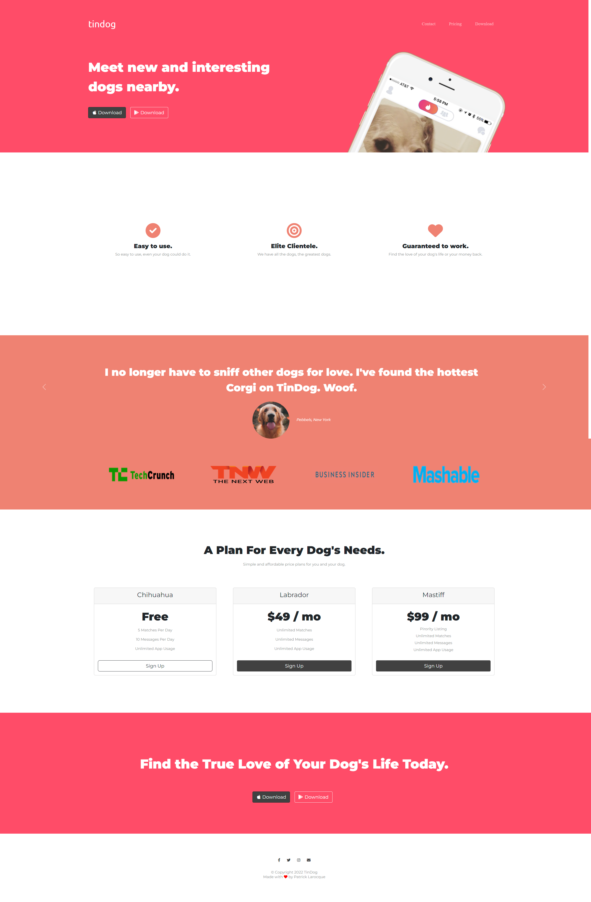

# Front-End Web Development - Assignment 2

Name: Patrick Larocque   
Student ID: 0879202  

  
Font end made using HTML5 CSS3 Bootstrap 5.2, and Bootstrap JavaScript Bundle.  
Reference materials located in the Assests folder.  
Assignment 2 directory pushed to github at: <https://github.com/PatrickLarocque/Web-Development>

## Features:  
  
Responsive design, smooth scroll navigation bar collapsing into a hamburger menu. Responsive testimonial carousel. Button hover effects, etc.

## Screenshots

