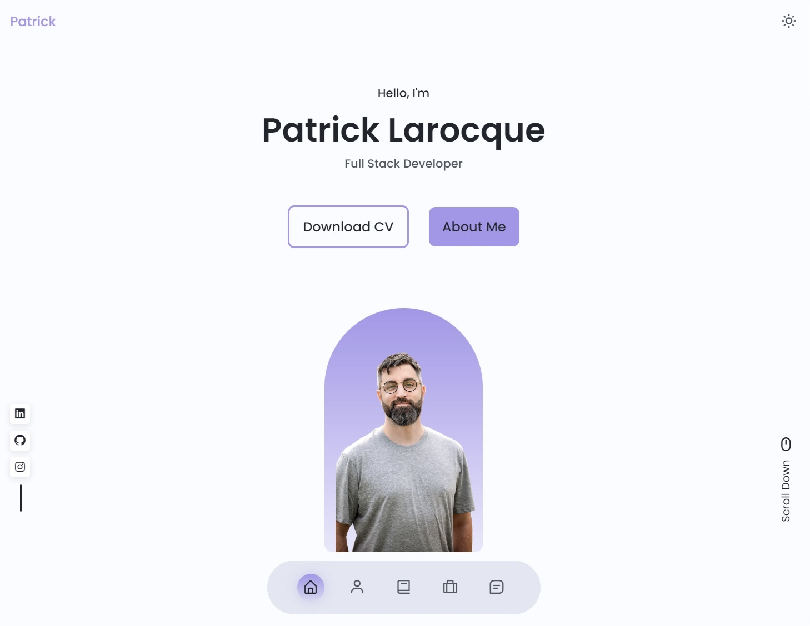
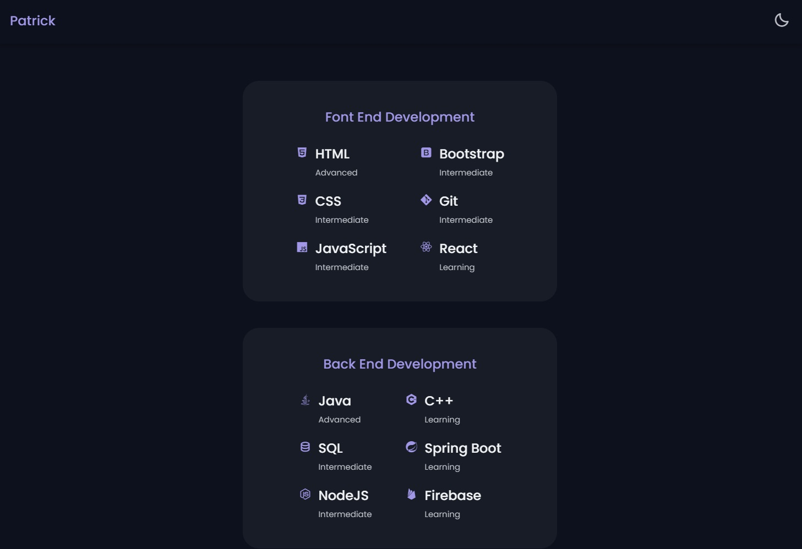
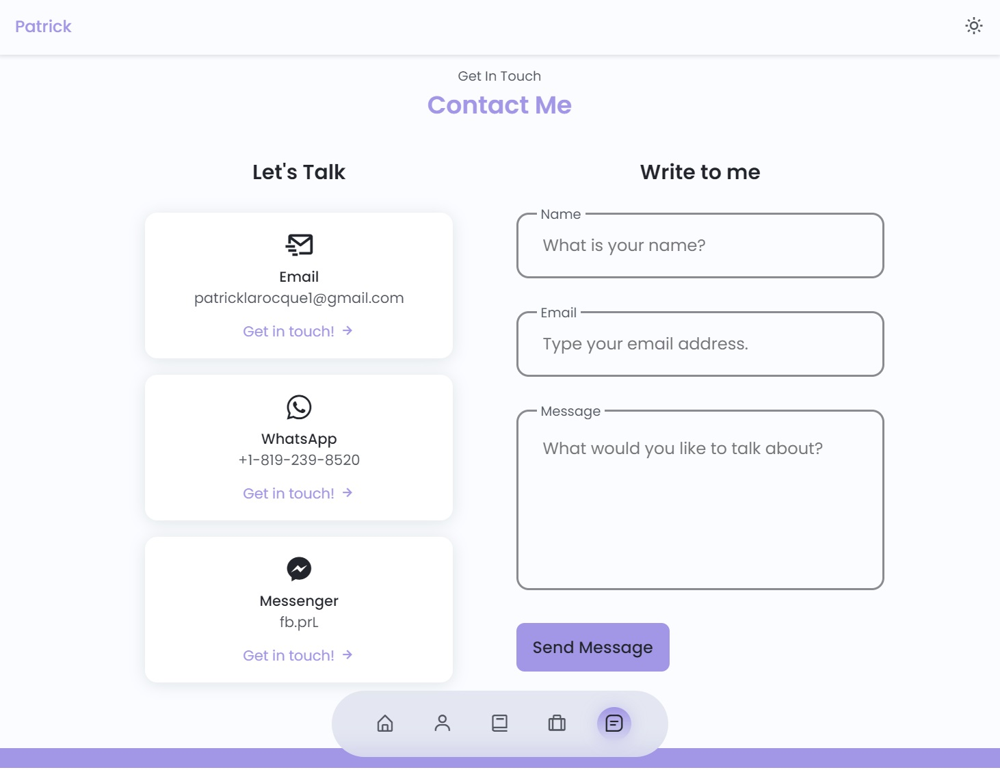
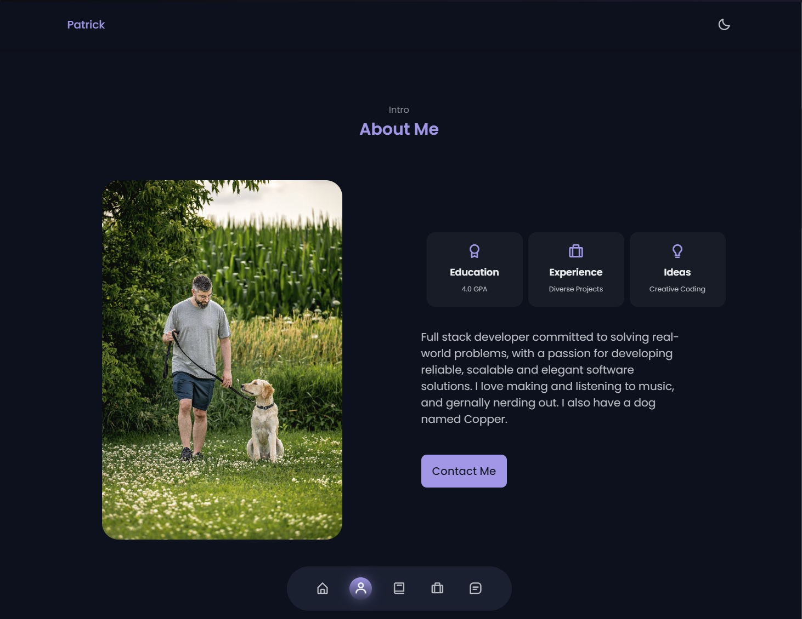
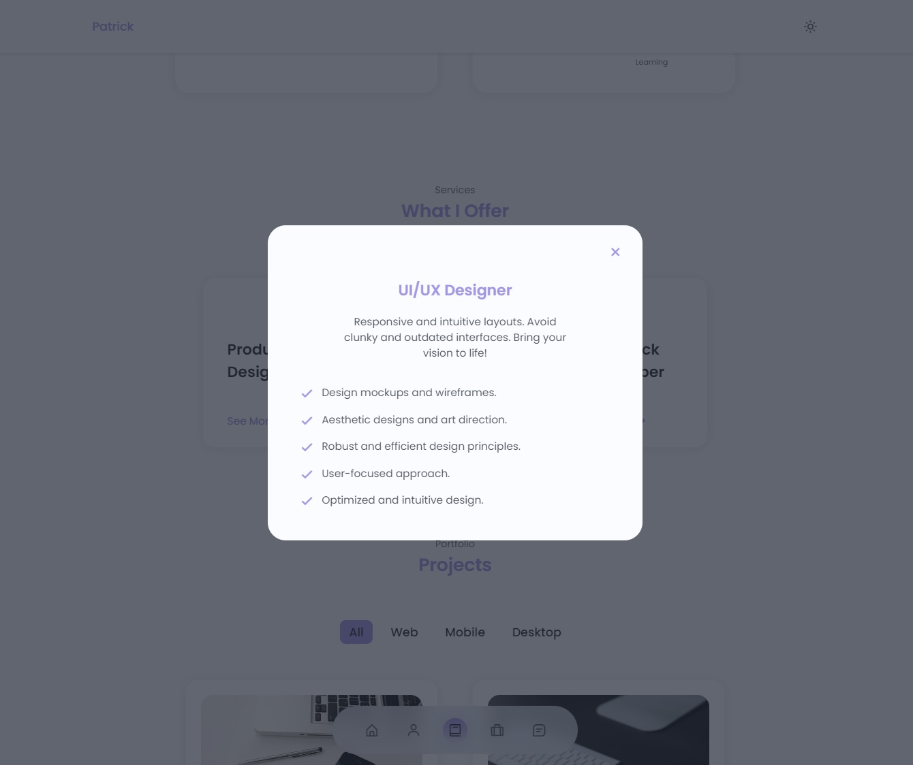

# Front-End Web Development - Final Project

Name: Patrick Larocque   
Student ID: 0879202   
  
  
Front end portfolio page made using HTML5, CSS3, and JavaScript.  
ScrollReveal.js for scrolling animations.  
MixItUp.js for filter functionality.  
Reference material located in the assets folder.   
Portfolio directory uploaded to github at: <https://github.com/PatrickLarocque/Web-Development>  

## Screenshots

